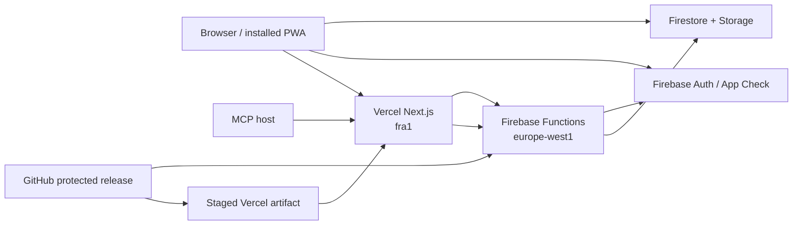
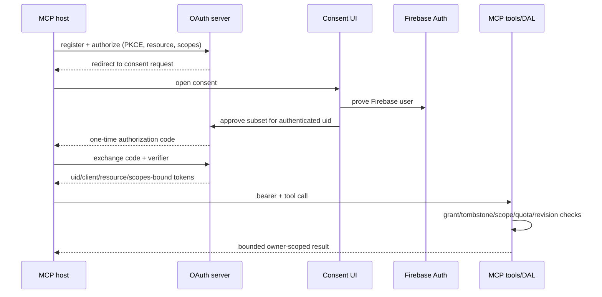

# Threadmap architecture

**Reviewed against repository:** 20 August 2026

## System context

Threadmap is a Next.js 16 local-first personal workspace with an optional Firebase cloud profile.
It has four operational planes:

- The browser owns interaction, local-mode persistence, optimistic state, and installed-PWA state.
- Vercel owns server rendering, App Router APIs, security headers, environment-aware MCP rewrites,
  and release health identity.
- Firebase owns identity, shared data, files, push delivery, scheduled work, destructive lifecycle,
  OAuth state, and server-enforced authorization.
- GitHub Actions owns repeatable verification and approved production orchestration. It is not the
  source of live platform truth; evidence must be collected after deployment.

## Domain model

`ThreadmapItem` is the shared graph node. Item types are task, project, habit, event, goal, and
note. Common state covers identity, lifecycle, timestamps, revision, owner, content, tags,
relationships, and attachments; specialized fields cover scheduling, recurrence, checklists,
habits, projects, goals, notes, and calendar sync. `OrbitItem` is deprecated compatibility only.

Hierarchy (`parentId`) and peer relationships (`linkedIds`) have different semantics. Parent
eligibility is validated at client/data/rules boundaries and repaired by an event Function if a
parent becomes ineligible. Peer relationships must remain symmetric. Every cloud write preserves
the authenticated uid and increments or checks the optimistic revision.

Tool data such as wishlist, Abitur, focus/flight sessions, briefing journals, dispatch plans,
settings, and toolbox state is owner-scoped but not forced into the item shape.

## Browser architecture

The App Router supplies route composition and public/API surfaces. The shared shell owns desktop
sidebar, mobile navigation, global command capture, detail editing, completion feedback, and focus
management. Providers compose:

| Provider area | Responsibility |
| --- | --- |
| Auth | Firebase session, explicit local mode, account transition |
| Data | subscriptions, optimistic store updates, conflict/retry state |
| Settings | theme, locale, visual and behavior side effects |
| PWA | service worker, install events, update consent, mobile viewport behavior |
| Error boundary | render containment and recovery affordance |

Local/demo mode uses account-scoped browser storage without calling cloud persistence. Cloud mode
uses the Firebase uid as the storage namespace and authorization principal. Legacy unscoped browser
keys may migrate only into the demo scope, never into an authenticated account.

## Synchronization and consistency

The client applies changes optimistically. Firestore operations serialize writes per item, include
revision checks, and queue retryable mutations in an outbox. Account-generation guards prevent an
operation started under one identity from committing into a later session. Verified local mirrors
support fast startup and recovery but are not authority for cross-user access.

Consistency is deliberately bounded rather than transactional across the entire graph:

- an item write uses a revision and owner checks;
- relationship operations update both sides together where supported;
- destructive item/file cleanup creates durable jobs for retry;
- account deletion creates a tombstone before removing credentials/data;
- upload intents reserve size/count and bind the final object to owner/item/path;
- background schedulers claim work before delivery/cleanup to limit duplicate effects.

At scale, query bounds, localStorage quota, subscription breadth, and Functions cold starts remain
capacity concerns. Production load evidence—not architecture intent—sets safe limits.

## Server/API boundary

App Router APIs include health and bounded wishlist scraping. Scrape routes authenticate the caller,
validate targets, apply SSRF defenses and response/time/concurrency bounds, and consume a shared
Firebase quota. API responses are private/no-store.

Firebase callable/HTTP Functions cover:

- auth email and MFA recovery-code lifecycle;
- push devices, schedules, and scheduled notifications;
- scrape quota;
- hierarchy repair;
- item and attachment deletion;
- upload begin/attach/cancel/cleanup;
- account export/deletion/retry;
- MCP authorization listing/revocation and the MCP/OAuth HTTP server.

Firestore and Storage Rules remain the direct-client authorization boundary. Functions re-check
authentication/ownership because Admin SDK access bypasses Rules. App Check reduces unauthorized
client abuse but never replaces user authorization.

## MCP security architecture

The MCP endpoint is stateless per request. Durable clients, authorization requests, codes, hashed
tokens, token families, user grants, idempotency records, delete confirmations, quotas, and audit
records live in Firestore with TTL policies where appropriate.

One dynamic client can have independent grants for multiple users. Revocation is user-scoped and
places an atomic grant barrier before derivative credentials are swept. Account deletion blocks
new authorization and all existing credential paths. Item text is data; it cannot change scopes or
skip confirmation.

## PWA lifecycle

The app registers one stable `/sw.js` URL. A no-store route embeds the exact release SHA in the
worker response bytes and cache names, so native byte comparison can discover a new deployment;
foreground, restored-network, and hourly checks cover long-lived SPA sessions. Install precaches an
offline fallback and current shell assets, but does not take control automatically. The app
announces a waiting update with a persistent localized prompt. Explicit acceptance writes a session
marker and sends `SKIP_WAITING`; only a matching later `controllerchange` reloads once.

This prevents an automatic worker update from replacing an unsaved editing session. Activation
claims clients and removes caches from other Threadmap revisions and legacy Orbit workers. Worker
and registration listeners are cancellable so provider remounts or locale changes do not multiply
notifications. Briefing schedule UPDATE/CLEAR messages carry a monotonically increasing generation
persisted in the worker's IndexedDB transaction. A clear advances that barrier before it is
acknowledged, so a delayed callback from the prior account cannot recreate notification state.

## Deployment and region contract

Production and staging are deliberately asymmetric:

| Concern | Staging/default | Production |
| --- | --- | --- |
| Firebase project | `threadmap-staging-9e0b6` | `orbit-9e0b6` |
| Firebase Functions | `europe-west1` | `europe-west1` |
| Vercel compute | configured `fra1` | configured and runtime-verified `fra1` |
| Storage CORS | localhost policy file | threadmap.app/www only |
| Deploy path | explicit staging npm scripts | protected workflow/guarded scripts |
| Evidence | engineering feedback | exact-SHA release record and approval |

Application code imports `FIREBASE_FUNCTIONS_REGION` from one source. Because Functions compile in
a separate package, the release audit verifies their `FUNCTION_REGION` matches rather than trying
to share a cross-build import. Vercel region is intentionally a separate constant because it names
a different provider's compute topology.

Next configuration resolves one validated Firebase project for the deployment environment and uses
it for both MCP and `/__/auth/*` rewrites. Production requires `orbit-9e0b6`; Vercel previews require
`threadmap-staging-9e0b6`, and a conflicting explicit project fails the build instead of routing one
auth surface to production. Settings displays the current origin's `/mcp` endpoint, so a staging
artifact cannot instruct a client to authorize against `threadmap.app`. The production web artifact is built once, staged with production
semantics without domain assignment, verified, then promoted. Firebase changes between staging and
promotion must be backward compatible with the old web artifact throughout the rollback window.

The staged production URL is a dark production-configured web candidate, not a substitute for the
staging environment. The workflow therefore fails closed before secrets or mutation. To enable it,
an upstream job must deploy the exact SHA to `threadmap-staging-9e0b6`, pair it with a
staging-configured web artifact, exercise authenticated read/write/upload/revocation contracts, and
pass validated evidence outputs to a separate production-environment job. This ordering ensures
protected approval occurs after evidence exists, not before a single combined job starts.

## Release identity and observability

`/api/health` separates liveness from configuration readiness and exposes safe release/runtime
metadata. Release identity resolves from an explicit build SHA before Vercel/GitHub SHA, with `local-0.1.0` only as a local
fallback. The route never returns secrets, but it can name missing production variables.

Observability must correlate web SHA/deployment id, Firebase project/Function name, user-safe
request identifiers, and timestamps. Browser error telemetry is not currently assumed; adding it
requires privacy/redaction/retention review. Firebase Functions still lack an independent artifact
SHA endpoint, so backend provenance is a documented gap.

## Security boundaries

1. Firebase uid is the workspace boundary.
2. Firestore/Storage Rules govern direct browser data access.
3. Functions authenticate and authorize again before Admin SDK operations.
4. App Check is abuse resistance, not identity or authorization.
5. OAuth client, user grant, resource, scope, token family, and deletion tombstone jointly govern MCP.
6. Browser content, MCP item text, query strings, and remote scrape responses are untrusted data.
7. GitHub environment approval and explicit project ids govern release authority.
8. Health/release evidence proves an artifact, not legal approval or platform ownership.

See `SECURITY_BOUNDARY_REVIEW.md` for assurance limits and `RECOVERY_RUNBOOK.md` for failure-plane
response.

## Quality strategy

The app unit suite covers pure and orchestration modules; Firebase Rules run with emulators; the
Functions package compiles then runs Node tests; Playwright cold-loads key routes on desktop
Chromium, mobile Chromium, and iPhone WebKit. Each cold load collects runtime errors, checks layout
overflow, and runs axe for moderate/serious/critical WCAG findings. A keyboard smoke verifies skip-link/main
focus and command-surface focus.

Automated checks do not replace real iOS/PWA testing, screen readers, two-user isolation, recovery,
provider control inspection, load behavior, alert delivery, or legal/release authority.
