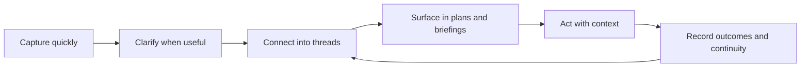
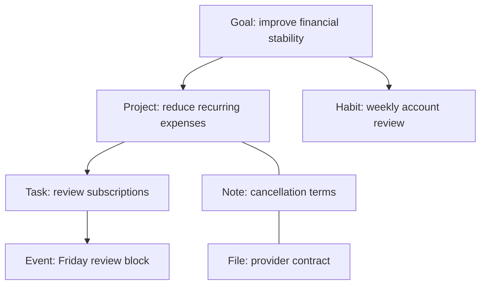

# Threadmap Product Doctrine

<!-- impeccable:product-schema 1 -->

> Threadmap is a personal-first operating system for capturing life quickly, connecting it meaningfully, and returning the right context when it is time to act.

This document is the canonical product record for Threadmap. It explains why the product exists, how its parts are intended to work together, and which implementation contracts future work must preserve.

`PRODUCT.md` owns product intent and behavior. [`DESIGN.md`](./DESIGN.md) owns the visual system. The README explains setup and operation. Security and release documents own deployment evidence and operational controls.

## Platform

web

Threadmap is a responsive web application and installable PWA. Desktop, mobile browser, and installed mobile use are first-class forms of the same product. Platform-specific behavior may adapt to the device, but the underlying data and product semantics remain consistent.

## Product in One Sentence

Threadmap lets a person capture something as quickly as they would put it in a basic task list, then progressively turn it into a rich thread of tasks, projects, goals, habits, notes, events, files, and relationships without having to reorganize the same information in several applications.

## Primary User

Threadmap is personal-first.

The primary user is an individual organizing several overlapping parts of life: work, study, personal administration, routines, ideas, plans, commitments, and long-running goals. They need speed when a thought appears, depth when planning becomes complex, and confidence that the same system will still make sense later and on another device.

The user should not need to adopt a rigid productivity methodology. Threadmap provides a connected model and useful rituals while allowing each person to decide how much structure a particular item deserves.

Selective sharing, external agents, and collaboration may support the individual, but Threadmap is not primarily an enterprise project-management system. Personal clarity and control take precedence over organizational administration.

## The Problem Threadmap Solves

Personal organization usually breaks in one of two directions.

Simple tools are fast, but context disappears. A task remains a sentence with no durable connection to the project, goal, decision, note, event, file, or routine that gives it meaning.

Powerful tools preserve context, but capturing and maintaining them becomes work of its own. Users must choose databases, properties, folders, templates, and views before they can record a thought.

People then split their life between a task manager, calendar, notes application, habit tracker, project tool, file store, and AI assistant. Every system holds a partial truth. The user becomes the integration layer.

Threadmap exists to remove that tradeoff.

It must remain quick enough for an unstructured thought and deep enough for a multi-month plan. Structure is available immediately, but it is not demanded prematurely.

## Product Thesis

### Fast at the edge, deep at the center

The edge of Threadmap is capture. It must be immediate, forgiving, and available wherever the user is.

The center of Threadmap is the connected graph. It preserves why an item exists, what it affects, where it belongs, and which information should travel with it.

The operational layer is the day. Briefings, calendar context, habits, unfinished work, notifications, and focused views compile the larger graph into a manageable present.

The product therefore follows this loop:

Threadmap succeeds when the user spends less effort remembering, reconstructing context, copying data, and deciding where information belongs.

## Positioning

Threadmap is not a task manager with backlinks added later. It is not a notes application with checkbox support. It is not an automatic calendar that treats every commitment as a scheduling problem.

Its distinct mechanism is a shared personal graph whose nodes can be acted on operationally.

- Tasks retain their relationship to outcomes and context.
- Notes remain connected to execution rather than becoming a separate archive.
- Goals can be traced to projects, habits, and concrete next actions.
- Habits participate in daily planning and long-term intent.
- Events supply real constraints and context to the day.
- Briefings synthesize the graph into timely decisions.
- Files remain attached to the work and decisions they support.
- AI clients can work with the same graph through controlled, account-scoped access.

The product promise is:

> Capture without friction. Build context without duplication. Return to what matters without reconstructing it.

## Core Product Principles

### 1. Capture must never require full organization

A user must be able to create a useful item before knowing its final type, parent, tags, date, priority, or relationships.

The command bar and quick input should accept natural language, partial information, dates, tags, and multiple captured thoughts. The common path stays short. Additional structure appears progressively in the detail surface or a later clarification step.

Fast capture is not a reduced version of Threadmap. It is the entrance to the complete model.

### 2. Complexity is progressive, not mandatory

An item may remain simple forever. A title-only task is valid. A short note is valid. Threadmap must not punish light use with required metadata that does not improve the next decision.

When complexity is useful, the same item can acquire dates, notes, files, tags, a parent, peer relationships, checklists, dependencies, and links to other objects. The user should not have to recreate it in another module to gain that depth.

### 3. Threads matter more than containers

Folders and sections can aid navigation, but the durable unit of meaning is a thread: a connected set of items that explains an intention and its execution.

A thread may cross object types:

Navigation, search, briefings, and detail views should reveal these connections without making the user manually traverse several isolated applications.

### 4. Today is a lens over the graph

The daily view is not a separate list with its own truth. It is a timely projection of tasks, events, habits, deadlines, carryover, and active projects from the connected system.

Completing, editing, linking, or rescheduling something from Today updates the underlying item. There must not be a dashboard copy and a separate canonical copy.

### 5. Unfinished work is continuity, not failure

Work not completed yesterday must not silently disappear, duplicate itself, or contaminate every future day as permanent overdue debt.

Threadmap explicitly surfaces carryover. The user can complete, reschedule, defer, return to its project, or intentionally drop it. The system preserves continuity while leaving the decision with the user.

Carryover is different from recurrence. An unfinished task remains the same commitment. A recurring habit or task creates or records the next expected occurrence according to its own cadence.

### 6. Briefings must synthesize rather than summarize everything

Briefings are an operating surface, not a feed.

A useful briefing combines the minimum information needed to orient the user:

- Relevant calendar commitments
- Tasks due or intentionally planned
- Work carried over from yesterday
- Habits expected in the current period
- Important project or goal context
- Changes requiring attention
- A concise look ahead

Morning and daily briefings answer, "What deserves my attention now, and why?" Evening briefings answer, "What changed, what remains open, and what should tomorrow inherit?"

Every briefing statement should be grounded in user data and should lead back to the source item. Briefings must avoid generic encouragement, manufactured urgency, and excessive notifications.

### 7. Habits are connected practices, not isolated streak counters

A habit represents a repeated practice with a frequency. Frequency is essential to its meaning and belongs in the creation flow.

Habit completion is recorded as history rather than rewriting the identity of the habit. A missed occurrence does not generate unlimited overdue debt. Streaks may inform the user, but the interface must not use shame or artificial loss aversion.

Habits can support goals, projects, or areas of life. Their presence in briefings and daily views should respect their cadence, preferred timing, and completion history.

### 8. The system must show honest state

Threadmap must never imply that data is safely synchronized when it is only stored locally, still pending, conflicted, or rejected.

Local save, cloud synchronization, offline state, conflict state, authentication, calendar connection, notification delivery, and MCP access are distinct states. The interface and implementation must represent them honestly.

Trust is more important than appearing instant or magical.

### 9. Personal data remains account-scoped and user-controlled

An authenticated account is a hard tenant boundary. Data, files, subscriptions, calendar tokens, notification registrations, caches, and MCP grants belonging to one user must never be visible or writable by another.

Signing into the same account on another device should produce the same cloud-backed map. Switching accounts must replace the account context completely rather than blending stores. Moving local-only information into an account requires an explicit migration, import, or merge decision.

Export, recovery, and deletion are product capabilities, not administrative afterthoughts.

### 10. AI proposes; the person decides

AI can parse capture, retrieve context, draft structure, identify relevant relationships, prepare briefings, and operate through MCP. It must not quietly redefine the user's commitments or relationships.

Meaningful writes should be attributable, reviewable, and reversible. Destructive operations require explicit confirmation. AI-created items must obey the same account isolation and data validation as human-created items.

Threadmap should prefer grounded answers linked to real items over generic conversation.

### 11. Mobile is not a compressed desktop

Mobile use centers on capture, Today, tasks, habits, notes, search, quick decisions, and briefings. Touch targets, safe areas, installed-PWA behavior, keyboard movement, and offline transitions are fundamental product requirements.

Desktop can expose more graph density, simultaneous context, and persistent navigation. Both surfaces operate on identical domain objects and semantics.

### 12. Specialized tools must strengthen the same system

Flight, Dispatch, Briefing, Wishlist, Abitur, and future tools may provide purpose-built workflows. They must not become disconnected applications with duplicate records or incompatible interaction rules.

A specialized tool should either create standard Threadmap objects, project a useful lens over them, or add domain-specific data that remains connected to the map.

## Product Language

The following terms have specific meanings in Threadmap.

| Term | Meaning |
| --- | --- |
| Item | A durable object in the personal system, such as a task, project, goal, habit, note, event, or file. |
| Node | The graph representation of an item. Product copy normally uses the item's concrete type rather than "node." |
| Thread | A meaningful connected set of items, potentially crossing several types. |
| Parent | The item providing structural context or decomposition for another item. |
| Child | An item organized beneath a parent. |
| Peer link | A meaningful non-hierarchical relationship between two items. |
| Reverse link | The automatically visible incoming side of a relationship. |
| Carryover | An unfinished commitment intentionally surfaced from an earlier day. |
| Briefing | A concise, source-grounded operational synthesis for a particular time or purpose. |
| Local mode | Use backed by storage on the current device without authenticated cloud synchronization. |
| Cloud mode | Authenticated, account-scoped storage and synchronization across devices. |
| Connection | An authorized external integration such as Google Calendar or an MCP client. |

Terminology should remain consistent across navigation, creation, detail views, settings, documentation, and external APIs.

## Domain Model

### Shared object behavior

All primary objects should support a coherent shared foundation where applicable:

- Stable identity
- Owner or local-store boundary
- Created and modified timestamps
- Completion or lifecycle status
- Parent and child relationships
- Peer relationships and reverse links
- Tags
- Notes or description
- Attachments
- Archive and recovery behavior
- Source or provenance when externally created
- Local and cloud persistence through the same domain semantics

Type-specific fields extend this foundation rather than creating unrelated data systems.

### Object semantics

| Type | Purpose | Minimum meaningful capture | Progressive enrichment |
| --- | --- | --- | --- |
| Task | A concrete action or commitment | Title | Date, deadline, priority, status, checklist, duration, parent, links, notes, files |
| Project | A bounded outcome requiring multiple actions | Name and intended outcome | Status, milestones, tasks, notes, files, goal links, review context |
| Goal | A desired longer-term result | Name and definition of success | Target, horizon, projects, habits, evidence, progress context |
| Habit | A repeated practice | Name and frequency | Preferred days or time, reminders, goal links, history, notes |
| Event | A time-bound commitment or occurrence | Title, date, and time when applicable | Calendar source, attendees, notes, linked tasks or projects |
| Note | Captured knowledge, thought, decision, or reference | Content | Title, tags, links, parent context, files, extracted actions |
| File | Supporting material | File identity and content | Description, linked items, source, upload and access state |
| Wishlist item | A considered future purchase or desire | Name or URL | Price, image, category, notes, priority, source, related goal or project |

Minimum meaningful capture is a product guideline, not permission to block capture unnecessarily. When a required detail is unknown, Threadmap should allow an Inbox or draft state rather than discard the thought.

### Relationship integrity

- Relationships use stable IDs, not display names.
- Incoming and outgoing relationships remain consistent.
- Deleting or archiving an item must not leave misleading active links.
- Moving an item between parents must preserve unrelated peer links.
- Relationship traversal must remain account-scoped.
- The interface distinguishes hierarchy from association.
- Suggested relationships are not silently treated as user-confirmed meaning.

## Core Operating Flows

### Capture

Capture begins from quick input, the command bar, a contextual create action, or a specialized tool.

The parser may recognize item types, dates, tags, priorities, parent references, and multiple entries. Keyboard submission and visible-button submission must produce the same interpretation. Unknown syntax remains part of the user's text rather than being silently discarded.

Capture should succeed locally before optional enrichment or cloud synchronization delays the user. Failures must preserve the entered text and offer a clear retry path.

### Clarify

The detail panel is where a simple capture can become a durable thread. It exposes type-appropriate fields while preserving consistent placement and behavior for shared actions such as status, type, relationships, tags, notes, files, archive, and delete.

Changing an item's type or status must update the canonical item and preserve compatible information. Incompatible fields require an explicit, understandable resolution rather than silent loss.

### Connect

Users can establish hierarchy and peer relationships from creation, the detail panel, search, graph views, and relevant specialized tools. Reverse links make context discoverable from either side.

Connections should answer real questions: what is this for, what does it depend on, where did it come from, and what else should be visible when acting on it?

### Act

Dashboard, Today, Dispatch, Calendar, task views, habits, notifications, and briefings surface actions from the same underlying map.

Completing an item updates every projection. Opening it should reveal the relevant notes, files, parent, linked items, and history without forcing the user to reconstruct context.

### Reflect and continue

Completion history, habit logs, briefing outcomes, carryover, archives, and project status preserve continuity. Reflection should help the user decide what changes next, not merely produce analytics.

## Briefings and Daily Continuity

Briefings are one of Threadmap's central differentiators and must remain deeply integrated with the object graph.

### Morning or daily orientation

The daily briefing should prioritize:

- Today's calendar reality
- Explicitly planned and due tasks
- Carried-over work
- Expected habits
- Important deadlines and active outcomes
- Recent changes that alter the plan

### During the day

The system should make replanning cheap. Completing, deferring, or rescheduling work must immediately update the day's projections without duplicating the underlying item.

### Evening continuity

The evening briefing should distinguish:

- Completed commitments
- Work still intentionally active
- Work to reschedule or return to its project
- Habits completed or missed
- Tomorrow's fixed commitments
- Items needing clarification rather than automatic carryover

The system should not automatically claim that every incomplete item belongs tomorrow. It should surface a compact decision.

## Habits

Habit implementation must preserve the difference between identity, schedule, and occurrence.

- The habit object defines the practice and cadence.
- Each completion is a dated occurrence.
- Frequency determines when the habit is expected.
- Reminders are delivery preferences, not the source of truth.
- Briefings derive expected habits from cadence and history.
- Editing future cadence does not falsify historical completion records.
- Archiving a habit stops future expectations while preserving history.
- A missed occurrence is information, not a task that multiplies indefinitely.

Habit insights should help the user adjust a practice. They should not manipulate the user into maintaining meaningless streaks.

## Calendar and Time

Calendar information provides constraints and context. It does not own the entire task graph.

Google Calendar synchronization and imported events must preserve source identity so that updates do not create duplicates. Calendar writes, deletions, and reconnects require clear ownership and error behavior.

Threadmap distinguishes at least three temporal concepts:

- When something occurs or is intentionally scheduled
- When something is due
- When something is available or relevant to surface

These concepts may share a compact interface, but the implementation must not collapse them when their behavior differs.

## Local, Cloud, and Multi-Device Behavior

### Local mode

Local mode allows useful operation without requiring an account. Data remains associated with the current browser or installed application storage unless the user explicitly exports or migrates it.

Local mode must not pretend to provide multi-device backup. Clearing device storage can remove local data, and the product must communicate that risk honestly.

### Cloud mode

Cloud mode is authenticated and account-scoped. It provides synchronization across devices, cloud files, push-related capabilities, connected services, account management, and recovery paths.

A local write and its cloud acknowledgment are separate states. The application should remain usable during temporary network failure and synchronize pending changes when connectivity returns.

### Account isolation

Every cloud read and write must derive ownership from verified authentication rather than trusting an owner identifier supplied by the client.

Account changes require a complete context transition:

- Unsubscribe old account listeners
- Stop or rebind pending account operations
- Clear or namespace account-specific stores and caches
- Replace files and object indexes
- Rebind push-notification registration
- Rebind calendar and MCP connection state
- Prevent previous-account data from flashing during loading

The same user on several devices should converge on the same account state. Different users on the same device must remain isolated.

### Conflict behavior

Threadmap must not silently overwrite a newer cloud copy or discard a valid local change.

Conflict handling should:

- Preserve both recoverable versions
- Identify the item, fields, devices, and timestamps involved
- Auto-merge only when the result is unambiguous
- Ask the user when meaning could be lost
- Keep an audit or recovery path after resolution
- Avoid repeating the same warning after a successful resolution

## External Connections and MCP

MCP makes the personal map available to authorized AI clients. It is an extension of the account security model, not a private administrator shortcut.

Each connection must:

- Be created through an authenticated authorization flow
- Bind to the user who approved it
- Receive only the scopes it needs
- Respect the same tenant isolation as the application
- Validate all input through the normal domain rules
- Expose identifiable provenance for created or changed items
- Be individually revocable
- Expire or rotate credentials safely
- Record meaningful activity for review

Read-only and write-capable access should be distinguishable. Destructive or high-impact operations require stronger confirmation than ordinary creation.

The application should explain what MCP is, what a particular client can access, how to configure it, and how to revoke it without requiring the user to understand internal infrastructure.

## Notifications

Notifications exist to return attention to an intentional commitment. They are not an engagement channel.

Valid notification categories include user-requested reminders, briefing availability, habit reminders, due work, and meaningful synchronization or security events.

Notifications must be account-scoped, respect user preferences and timezone, avoid duplicate delivery, and deep-link to the relevant application context. Denied permission or failed delivery must not change the underlying schedule or completion state.

## Specialized Surfaces

### Dashboard

The dashboard or daily home surface provides orientation, current counts, calendar context, carryover, habits, and direct access to today's work. It is a projection, not a second data store.

### Dispatch

Dispatch helps turn available work and calendar constraints into an intentional route through the day. Its decisions should update standard items rather than maintain a private task copy.

### Briefing

Briefing synthesizes source-grounded context for a time or purpose. It should remain concise, traceable, and actionable.

### Flight

Flight supports focused execution. It should reduce surrounding interface noise while keeping the active item's relevant thread available.

### Wishlist

Wishlist provides purchase-oriented fields and media while retaining the same ownership, sync, conflict, detail, archive, and relationship behavior as other Threadmap data.

### Abitur and future domain tools

Domain tools may introduce purpose-specific calculations and views. Their records should connect to ordinary goals, projects, tasks, events, notes, and files wherever those concepts overlap.

## Experience Contracts

### One system, consistent behavior

Shared actions must behave consistently across item types. Menus, detail panels, status controls, type changes, delete confirmation, archive behavior, tags, and relationship controls should not be reimplemented independently without a domain reason.

### Safe speed

Optimistic interaction is encouraged when failure is recoverable. The UI must retain input, show pending state, and offer retry or undo. Speed must not be created by hiding uncertainty.

### Accessible by default

Threadmap targets WCAG AA behavior and supports keyboard, touch, screen readers, reduced motion, high contrast, theme choice, and font-size adaptation.

Every route has a coherent main landmark and heading. Icon-only controls have accessible names. Dialogs restore focus. Mobile controls provide suitable touch targets. Essential information never depends only on color, hover, or motion.

### Calm density

Threadmap may hold complex information, but it should reveal complexity through hierarchy and progressive disclosure rather than visual noise. The interface should feel like a working surface, not a stream of alerts or a collection of decorative cards.

### Honest errors

Errors identify what failed, what was preserved, and what the user can do next. Authentication, permissions, synchronization, parsing, network, calendar, notification, and file failures should not collapse into an unexplained "something went wrong" when a safer actionable explanation is available.

## Implementation Architecture

Threadmap is implemented as a TypeScript web application using Next.js and React. It is delivered as a responsive site and installable PWA. Client state and persistence support immediate interaction, while Firebase services provide authenticated cloud capabilities.

The implementation includes these major boundaries:

| Boundary | Responsibility |
| --- | --- |
| Domain model | Shared item types, relationships, lifecycle rules, validation, and mutation semantics |
| Capture and parser | Natural-language input, tags, dates, type intent, and multi-item interpretation |
| Client state | Immediate application state, optimistic behavior, selected context, and UI coordination |
| Local persistence | Device-resident data and pending work needed for local-first interaction |
| Cloud repository | Account-scoped reads, writes, subscriptions, synchronization, and conflict metadata |
| Authentication | Account identity, provider flows, sessions, MFA, and recovery |
| File storage | Account-scoped attachments and associated metadata |
| Functions and scheduled work | Protected server operations, briefings, notifications, integrations, and maintenance |
| Calendar integration | OAuth authorization, source-aware synchronization, and event mapping |
| MCP service | OAuth-bound external access to validated Threadmap operations |
| Presentation | App shell, routes, detail panel, command bar, dashboards, tools, and responsive behavior |

### Architectural rules

- Product rules belong in shared domain or service code, not only in individual pages.
- UI projections do not maintain competing canonical copies of items.
- Local and cloud implementations use the same object semantics.
- Mutations pass through shared validation and persistence boundaries.
- Authentication identity is established server-side for protected operations.
- Account-specific cache keys and subscriptions include the authenticated identity.
- External integrations preserve source identifiers and provenance.
- Background work is idempotent where retries are possible.
- Destructive actions support confirmation and recovery appropriate to their impact.
- New object types participate in export, import, archive, deletion, sync, search, relationships, and account isolation before they are considered complete.

### Loading and dependency policy

Local-only use should not pay the startup cost of cloud-only security or integration dependencies. Firebase App Check, MFA flows, calendar clients, and specialized settings code should load when their capability is needed.

Authentication resolution should preserve the geometry of the final shell to avoid disruptive layout shifts. Mobile keyboard and viewport changes must not hide the active composer or primary confirmation controls.

### Data lifecycle

Every durable object needs defined behavior for:

1. Creation
2. Local persistence
3. Cloud synchronization when applicable
4. Update and conflict handling
5. Search and graph indexing
6. Export and import
7. Archive and restore
8. Deletion and account deletion
9. External provenance and audit when applicable

Features that implement only the visible creation screen are incomplete.

## Testing and Quality Gates

The highest-risk behavior deserves explicit automated coverage.

### Required behavioral coverage

- Parser behavior for mixed text, dates, tags, hashtags, and multiple items
- Consistent keyboard and button submission
- Relationship creation, reversal, movement, archive, and deletion
- Type and status changes without silent data loss
- Carryover versus recurrence
- Habit cadence and completion history
- Briefing source selection and account scope
- Local writes, offline queueing, reconnection, and conflicts
- Switching between accounts on one device
- Same-account synchronization across several devices
- Firestore and storage tenant isolation
- MCP authorization, scope, revocation, and cross-user denial
- Calendar deduplication and reconnect behavior
- Export, import, deletion, and recovery drills
- Mobile safe areas, installed-PWA viewport changes, and keyboard avoidance

### Release expectations

- TypeScript, lint, tests, and production build pass.
- Security rules and protected server boundaries are exercised against unauthorized access.
- Migration and rollback paths exist for data-model changes.
- Monitoring can distinguish authentication, synchronization, integration, and application failures.
- User-visible errors retain recoverable input and provide an actionable next step.
- Critical workflows are checked on desktop, mobile browser, and installed PWA behavior.

## Security and Privacy Commitments

Threadmap contains a person's plans, relationships, routines, files, and private reflections. Security is therefore part of product correctness.

- Default access is private.
- Tenant separation is enforced at every cloud boundary.
- Secrets and provider credentials remain server-side or in an appropriate protected store.
- Authorization is checked for every protected operation, not inferred from interface visibility.
- Input from parsers, imports, MCP clients, URLs, and integrations is untrusted until validated.
- Sensitive changes and external access are attributable.
- The user can inspect and revoke active sessions and connections.
- Export and account deletion are understandable and testable.
- AI usage and data handling are stated plainly.
- Security controls must not make local capture or ordinary daily use unnecessarily fragile.

## Brand Commitments

The product is named **Threadmap**. Historical repository or infrastructure names must not appear as the user-facing product name.

The brand metaphor is functional:

- **Thread** represents continuity and meaningful relationships.
- **Map** represents orientation across a complex personal system.

The voice is calm, direct, precise, and respectful. Threadmap does not scold, infantilize, exaggerate productivity, or imply that every unfinished item is a personal failure.

The product should feel capable without feeling corporate, and intelligent without pretending to know more than the user.

## Accessibility and Inclusion

Personal organization is used under stress, with limited time, on small screens, with imperfect attention, and by people with varied motor, visual, and cognitive needs.

Threadmap therefore treats clarity, predictable behavior, readable contrast, keyboard access, touch sizing, reduced motion, recoverable errors, and plain language as core product requirements.

Fast capture should remain possible when the user cannot provide complete structure. Briefings should reduce cognitive load. Progressive disclosure should make complexity available without making it unavoidable.

## Non-Goals

Threadmap is not trying to become:

- A public social network
- A team-chat platform
- A surveillance-based employee productivity system
- A fully autonomous agent that controls the user's schedule
- A universal document editor or website builder
- An enterprise portfolio-management suite
- A rigid implementation of one productivity methodology
- A streak game designed primarily to maximize engagement
- A cloud-only service that becomes useless without a network

These boundaries can be revisited deliberately, but they must not erode the personal-first product while entering through isolated feature requests.

## Feature Decision Framework

Before adding or substantially changing a feature, ask:

1. Does it make capture faster or safer?
2. Does it help build or reveal a meaningful thread?
3. Does it improve the user's next decision or preserve continuity?
4. Does it use existing canonical objects rather than duplicate them?
5. Does it preserve local use, account isolation, sync honesty, and exportability?
6. Does it work coherently on mobile and desktop?
7. Can complexity remain optional for users who do not need it?
8. Does AI remain grounded, attributable, and reversible?
9. Does it strengthen personal organization rather than pull Threadmap toward generic team software?
10. Is the feature worth the maintenance and cognitive cost it adds?

A feature that adds a new destination without improving the connected loop should usually be rejected or redesigned as a lens over existing data.

## Product Success

Threadmap is succeeding when users can truthfully say:

- I can capture something before I lose it.
- I can add depth later without recreating it elsewhere.
- I can see why a task matters and what context belongs with it.
- My unfinished work does not disappear or multiply unexpectedly.
- My briefings help me orient without overwhelming me.
- My habits, goals, projects, calendar, notes, and files reinforce one another.
- I see the same trustworthy map across my devices.
- Another account can never see or alter my information.
- An AI agent can help without silently taking control.
- I can leave with my data if I choose.

Useful product measures include capture completion, time to capture, clarification rate, connected-item usage, briefing usefulness, repeated carryover, habit review, conflict frequency, successful multi-device convergence, recovery success, and long-term retention. Metrics must diagnose value and trust rather than reward the creation of more items for its own sake.

## Current Capability Map

Threadmap's implemented product surface includes:

- Unified tasks, projects, goals, habits, notes, events, files, and archive behavior
- Parent-child relationships, peer links, reverse links, and graph navigation
- Natural-language command capture and quick creation
- Dashboard and daily orientation
- Carryover for unfinished work
- Habit frequencies, completion, reminders, and history
- Calendar views and Google Calendar synchronization
- Notes, checklists, tags, attachments, priorities, dates, and status
- Briefing, Dispatch, Flight, Wishlist, Abitur, and related specialized tools
- Local browser operation and authenticated cloud synchronization
- Multi-device account use
- Push notifications and scheduled briefings or reminders
- Import, export, conflict recovery, archive, and deletion paths
- Installable PWA behavior with mobile navigation and safe-area support
- Account-scoped MCP access for compatible AI clients
- Authentication, MFA, recovery, App Check, and production security controls

This inventory is not a reason to add more modules. It is the raw material for a more coherent personal operating system. Future work should deepen the connections, reliability, and usefulness of this existing system before broadening its category footprint.

## Durable Open Decisions

The following areas remain strategic decisions rather than assumed commitments:

- How far selective project or household sharing should extend
- Whether sensitive content receives an end-to-end encrypted private vault
- Whether native mobile companions are justified beyond the PWA
- Which AI providers, local models, or bring-your-own-key modes should be supported
- How much scheduling assistance is useful without compromising user agency
- Which external integrations deserve first-class bidirectional synchronization

Until decided, new work must not quietly commit Threadmap to enterprise collaboration, autonomous scheduling, provider lock-in, or a cloud-only architecture.

## Final Product Standard

Threadmap should feel simple at the moment of capture and increasingly intelligent as context accumulates.

Its quality is not measured by how many object types, dashboards, or AI actions it contains. It is measured by whether those parts preserve one trustworthy thread from intention to action to reflection.

The governing principle is:

> Nothing important should be difficult to capture, isolated after capture, lost between days, inconsistent between devices, or changed by an external system without the user's knowledge.
