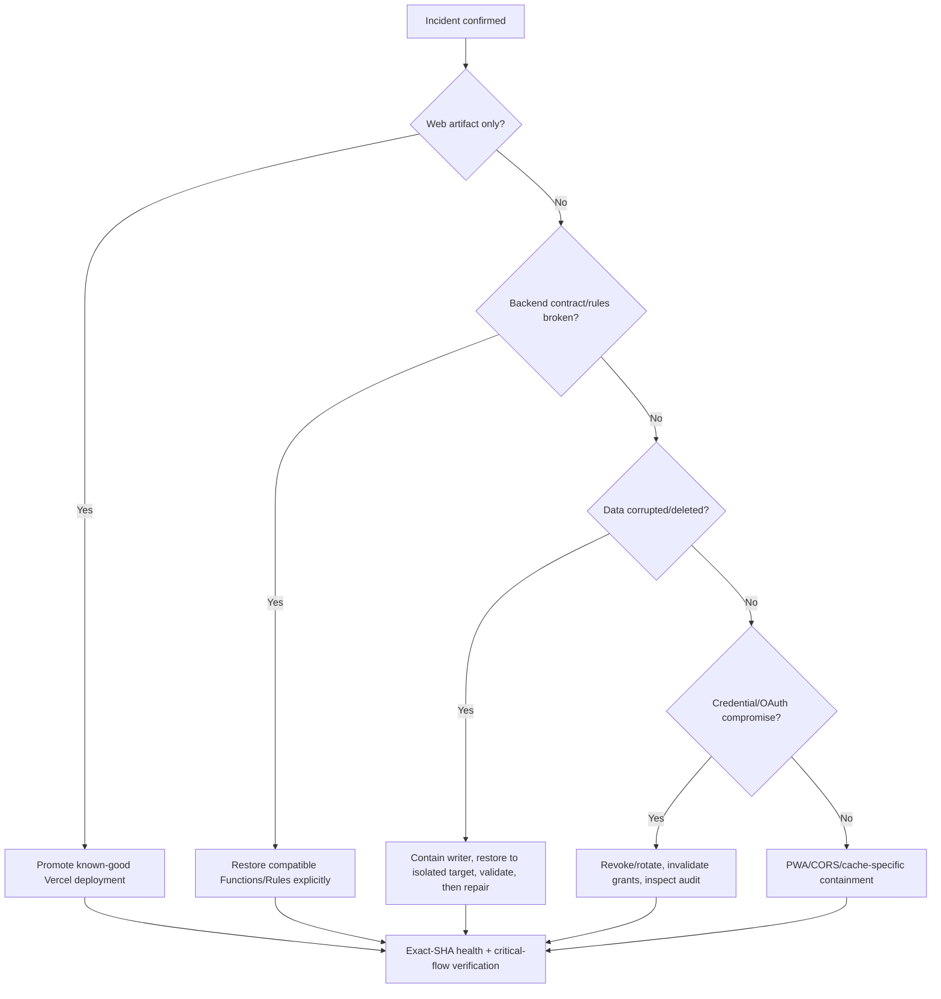

# Threadmap recovery runbook

**Runbook reviewed:** 20 August 2026
**Current production drill:** must be recorded for the exact release in `RELEASE_DRILL_EVIDENCE.md`

This runbook covers web release, Firebase Functions/Rules, Firestore data, Storage/CORS, credentials,
OAuth/MCP, and PWA cache failure. Recovery authority must be explicit; access to a CLI is not
authorization to mutate production.

## Roles and minimum record

Assign before launch:

- incident commander and deputy;
- Vercel release/rollback operator;
- Firebase/GCP data and Functions operator;
- security/privacy decision owner;
- communications/status owner;
- independent verifier.

For every operation record incident id, severity, operator/approver, UTC timestamps, exact web SHA
and deployment id, Firebase project/resources, commands or console operation ids, evidence links,
validation results, customer impact, and observation-window end. Never paste tokens, recovery codes,
user content, or unredacted personal ids into the record.

Preserve the release SHA, Vercel deployment/request ids, Firebase execution ids, and an exact UTC
log-query window before provider retention expires. Runtime logs and exported telemetry must also
exclude App Check values, scrape-shared secrets, OAuth codes, email action links, product lookup
terms/URLs, and item contents. If a configured drain is unhealthy, establish the bounded
Vercel/Firebase console or CLI fallback and assign an operator before continuing recovery.

## Pre-release backend mutation gate

The production workflow's pre-promotion Vercel URL is production-configured and still talks to the
production backend; it is not a staging environment. Before approving that workflow, independently
deploy the exact SHA's Firebase plane to `threadmap-staging-9e0b6` and pair it with a
staging-configured web artifact. Exercise authenticated sign-in, owner-scoped read/write, file
upload/cancellation, protected callable/HTTP Functions, MCP authorization/revocation, and both old
and candidate client contracts. Record the staging deployment ids, exact SHA, synthetic accounts,
results, and rollback steps at an immutable HTTPS evidence URL. A URL alone is not proof: the future
staging job must validate SHA/status and pass its outputs to a separate production-environment job,
whose reviewer inspects them before any mutation. The current release workflow deliberately exits
before credentials while that topology is absent.

The staging browser needs a stable reviewed HTTPS origin admitted explicitly by staging Storage
CORS. The checked-in staging policy currently allows localhost only, so hosted upload/cancellation
evidence remains blocked until that origin is selected; do not solve this with a wildcard or broad
`*.vercel.app` policy.

Do not approve production Firebase mutation when that record is missing, stale, built from another
SHA, or limited to unauthenticated health/discovery probes.

The same pre-release record must prove the auth-email Function has both `RESEND_API_KEY` and
`AUTH_EMAIL_HMAC_KEY` bound in Secret Manager. Using a disposable staging mailbox, verify
passwordless email-link delivery, `threadmap.app` landing, one-time/expired-link rejection,
enumeration-safe responses, and bounce/suppression recovery. Also prove password authentication is
disabled and an unused address gets no session before opening its inbox link. Do not add a production email send to
the generic automated verifier: it has no mailbox assertion or cleanup boundary.

For staging, configure `THREADMAP_APP_ORIGIN=https://staging.threadmap.app` together with
`AUTH_EMAIL_FIREBASE_ACTION_HOSTS=threadmap-staging-9e0b6.firebaseapp.com,threadmap-staging-9e0b6.web.app` and
prove production Firebase action URLs are rejected. Production explicitly uses
`https://threadmap.app` with the two `orbit-9e0b6` Firebase Hosting hosts. Never partially change the
pair or treat production's project-id-gated defaults as a staging fallback. Attachment-upload
initiation must accept only that same app origin outside the Functions emulator.

Before launch, revalidate `auth.threadmap.app` DKIM, custom MAIL FROM SPF/MX, DMARC alignment and
report destination; test that replies to `support@threadmap.app` reach the named on-call owner.
The codebase has no Resend event webhook today. Record an explicit approval and operating owner for
provider-native hard-bounce/complaint suppression, or block launch until a signature-verified,
idempotent webhook and suppression store exist. Alert and rehearse at least: bounce >2%, complaint
>0.05%, five consecutive provider/API failures, and sustained accepted-to-delivered latency >2m.
For low-volume auth mail, investigate every complaint and hard bounce even below percentage gates.

On an auth-email incident, stop retry amplification, preserve provider ids and redacted event/DNS
evidence, check Secret Manager binding and sender verification, confirm suppression state before
unsuppressing any address, and route users to the monitored support mailbox. Rotate the Resend key
or HMAC key only with an explicit blast-radius/link-validity decision and post-rotation staging test.

Also snapshot the Resend transactional-stream settings: open/click tracking must be off and sent-
email retention must be 30 days. Incident and privacy triage must distinguish `eu-west-1` sending
from US-hosted account/email metadata and follow the approved DPA/subprocessor/transfer record.
When users report expired-before-open links, reproduce through the real enterprise link scanner;
do not weaken one-time/expiry controls until scanner prefetch versus user consumption is proven.

## First 15 minutes

1. Declare severity and stop further releases. Preserve GitHub, Vercel, Firebase, Cloud Logging,
   DNS, and alert evidence.
2. Identify the affected plane and last-known-good full SHA. Query `/api/health` with cache bypass
   and save headers/body.
3. Stop or contain the faulty writer before restoring data. Examples include pausing a release,
   disabling a scheduled Function, revoking a compromised OAuth grant, or blocking a specific
   endpoint. Use the narrowest reversible control.
4. Determine whether credentials, tenant isolation, or personal data are involved. If so, start the
   incident-response/privacy assessment in parallel; do not wait for technical recovery.
5. Name the rollback/restore approver and independent target verifier.

## Decision tree



## Vercel web rollback

1. Identify a previously verified production deployment whose full SHA and backend compatibility
   are known. Do not rebuild from source for a rollback when an immutable known-good artifact exists.
2. Confirm the candidate belongs to the correct Vercel organization/project. Have a second operator
   read back deployment id, SHA, environment, and domains.
3. Promote/rollback to the known-good deployment using the Vercel production control with an audit
   record. Do not use an arbitrary preview URL.
4. Run:

```bash
npm run release:verify -- --url https://threadmap.app --sha <known-good-full-sha>
```

Supply `SCRAPE_RATE_LIMIT_SHARED_SECRET` through the protected process environment. Never put it in
the command line, evidence, or incident log; the verifier uses it only for the expected
`401 invalid_app_check` cross-plane boundary probe. Bind any Vercel bypass credential to this exact
target with `THREADMAP_VERCEL_BYPASS_ORIGIN`; never reuse the header on redirects or provider probes.

5. Exercise sign-in/local mode, read/write sync, a protected Function, file access, and OAuth
   discovery. Continue observation through at least one relevant scheduled-Function interval.

If health reports the old package version but wrong SHA, rollback has not been proved.

## Firebase Functions and Rules rollback

Web and backend versions overlap during deploy/rollback. Restore a backend only when it remains
compatible with both cached/old clients and the web artifact being restored.

1. Check deployment history, Functions names/regions, Rules release, indexes, secret bindings, and
   schema/data migrations. Rules rollback can restore availability while reopening a security hole;
   require security approval.
2. Check out the exact known-good `main` commit in a clean worktree and set:

```bash
export THREADMAP_RELEASE_SHA=<known-good-full-sha>
export THREADMAP_PRODUCTION_DEPLOY_CONFIRMATION=orbit-9e0b6
```

3. Use only the narrow guarded production command for the affected resources. Never use bare
   `firebase deploy` or the staging default as evidence of the production target.
4. Verify deployed Functions are in `europe-west1`, callable/HTTP contracts work, App Check behavior
   is intentional, and the web exact-SHA verifier passes.

The current backend lacks independent artifact-SHA reporting. Record Firebase release ids, build
logs, source SHA, and Function update timestamps as compensating provenance.

## Firestore restore and logical repair

1. Stop the faulty writer and preserve the incident window.
2. Select the closest PITR timestamp or backup before corruption. Record database, project,
   timestamp, retention deadline, and estimated loss window.
3. Restore into an isolated project/database when provider capability permits. Never overwrite the
   production database as the first validation step.
4. Validate collection/document counts and sampled invariants:
   uid ownership, item revisions, parent eligibility, symmetric links, attachment paths/registries,
   deletion/tombstone jobs, upload reservations, MCP grants/tokens, and TTL fields.
5. Reconcile verified records into production with a reviewed bounded repair plan. Run hierarchy or
   cleanup repair only after source data is validated.
6. Test two-user isolation, export, deletion, attachments, sync conflicts, background jobs, and MCP
   revoke after repair.

Never copy real production personal data to ordinary staging for a drill. Use synthetic markers and
disposable accounts. Keep source backups until validation and the observation window end.

## Storage and CORS recovery

Production CORS policy is `storage-cors.json`; staging/local is
`storage-cors.staging.json`. Production must contain only `threadmap.app` and `www.threadmap.app`.

1. Confirm the exact project and bucket before applying anything.
2. For an approved production correction, use the guarded script with exact release SHA and
   confirmation. It validates the bucket, applies the selected policy, reads the bucket back, and
   compares it semantically before success.
3. Test authorized upload/download, resumable upload and `DELETE` cancellation, and denial from an
   unapproved origin.
4. For missing/corrupt objects, validate owner metadata, registry/intents, item references, and
   malware/content policy before restoration. Do not make a bucket public as a recovery shortcut.

## Credential, App Check, and OAuth recovery

- Revoke the narrowest credential first; rotate dependent credentials only with a propagation plan.
- For Vercel/GitHub/Firebase deployment compromise, freeze releases, rotate tokens, audit deployments
  and environment changes, and migrate to short-lived federation where possible.
- For MCP compromise, revoke the affected user's grant/token family or client, verify old tokens are
  rejected, inspect bounded audit records, and avoid revoking unrelated users.
- For account compromise/deletion, preserve the tombstone and do not recreate the uid/data until
  identity and legal recovery requirements are satisfied.
- For App Check outage, distinguish client attestation failure from user authorization. Any temporary
  enforcement change requires time limit, monitoring, approver, rollback, and abuse review.

## PWA/service-worker recovery

The stable worker URL serves release-specific response bytes/cache names and updates require
explicit acceptance. After a rollback, clients can temporarily span old worker, candidate worker,
and restored web artifact.

1. Verify stable `/sw.js` returns `no-store`/`no-cache`, identifies the restored SHA in its response
   bytes/header, and differs byte-for-byte from the rolled-back candidate.
2. Confirm the update prompt appears without forced activation and that “Later” preserves open work.
3. Accept the update in a disposable tab and verify exactly one reload, old revision cache removal,
   offline fallback, and no loop.
4. Do not tell users to clear all site data unless account-scoped local/demo data loss is understood
   and consented. Prefer a normal worker update or targeted support procedure.

## Validation and closure

Recovery is not complete until:

- production health reports the intended full SHA and ready state in `fra1`;
- Firebase target and `europe-west1` Function contracts are verified;
- two-user isolation and critical auth/sync/file/MCP flows pass;
- alerts have cleared and logs show no continuing writes/errors;
- scheduled cleanup/notification behavior has crossed an observation interval;
- data loss and privacy/regulatory impact are assessed;
- evidence and customer/status communication are complete;
- follow-up actions have owners and deadlines.

Run a synthetic staging data restore and disposable-alias web rollback at least annually and after a
material persistence/release change. Run a production-control tabletop without touching data more
frequently. Historical drills never substitute for exact-candidate evidence.
