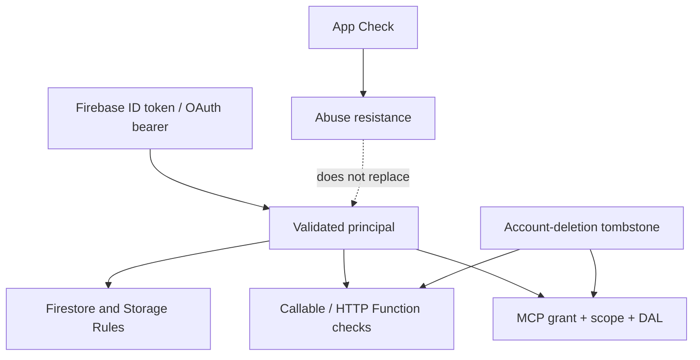

# Authentication and tenant-boundary review

**Repository review:** 20 August 2026
**Live verification:** not established for the current working tree
**Independent reviewer:** required before release

## Boundary model

Threadmap is a per-user workspace, not a shared-organization tenant system. The verified Firebase
Authentication uid is the tenant key. Component visibility, Zustand state, localStorage keys,
route names, request-provided user ids, and MCP content are not authorization boundaries.

## Boundary inventory

| Surface | Principal source | Server enforcement | Destructive control |
| --- | --- | --- | --- |
| Direct Firestore | Firebase request auth uid | deny-by-default Rules and owner fields/paths | Rules plus server Functions for cascades |
| Direct Storage | Firebase request auth uid | uid path/metadata Rules | registered deletion jobs and cleanup |
| Callable Functions | verified callable auth | exact uid and input allowlists; App Check where configured | recent-auth/tombstone/idempotent jobs as applicable |
| Scrape quota HTTP Function | verified Firebase bearer | uid equality, shared secret, hashed quota keys | no destructive data action |
| Account lifecycle | verified uid | owner-scoped export; tombstone before cleanup | durable deletion state and retry scheduler |
| Upload lifecycle | verified uid | item owner, reservation, path/size/type/count checks | cancel/cleanup jobs and prefix sweep |
| MCP consent | Firebase ID token | authenticated uid binds request/grant | approve/deny and per-user revoke |
| MCP tools | hashed bearer resolving principal | user grant, tombstone, resource, client, scope, quota, DAL owner | revision/idempotency; delete preview/confirm |
| Local/demo profile | explicit browser profile | no cloud security claim | browser-only deletion |

## Repository evidence

- Rules suites include authenticated owner paths and negative cross-user cases and run in a
  dedicated emulator job; they must not be inferred from a unit command that skipped emulators.
- Application runtime references use one Firebase Functions region constant. A recursive gate scans
  app and Functions runtime sources for US/divergent endpoints.
- Functions construct the effective uid from verified credentials and compare any compatibility
  `userId` input to it; Admin SDK operations do not rely on client UI state.
- Account deletion creates server-only state used as a barrier for Functions, MCP tokens, and
  delayed cleanup. Retention covers refresh-token and resumable-upload risk windows.
- MCP authorization is multi-user: consent binds to the current Firebase uid; user grants and
  token families preserve isolation when a shared dynamic client serves multiple users.
- MCP tool inputs contain no owner selector. Queries and writes derive owner identity from the
  authenticated principal. Outputs are bounded and sensitive settings/file fields are projected.
- Mutations require revisions and UUID idempotency ids; permanent deletion uses a short-lived,
  single-use owner/client/item/revision-bound confirmation token.
- PWA caching excludes APIs and now refuses basic responses marked `private`, `no-store`, or
  `Set-Cookie`, reducing future risk if personalized HTML is introduced.
- Application responses deny all parent framing with CSP `frame-ancestors 'none'` and legacy
  `X-Frame-Options: DENY`; the in-app PDF viewer is a child frame and does not require Threadmap
  itself to be embeddable.
- Private application route prefixes carry an HTTP `X-Robots-Tag` noindex directive in addition to
  robots.txt exclusions, preventing discovered authenticated URLs from being indexed as URL-only
  results while public trust/marketing pages remain indexable.
- Production deploy intent uses an explicit Firebase project, exact SHA, clean main tree, and
  protected staged Vercel artifact. Deployment authority is distinct from app authorization.

## Threat analysis

### Cross-user object access

Attack: substitute another uid/item/path in browser or Function input. Required defenses are
Rules ownership, server credential-derived uid, query owner filters, path binding, and negative
tests. A successful UI test alone proves nothing.

### Stale or replayed mutations

Attack: replay a captured MCP write, race a second device, or reuse a deletion token. Required
defenses are monotonic revisions, idempotency ids, serial/transactional updates, confirmation TTL,
and single-use consumption.

### Deleted-account resurrection

Attack: use a refresh token, OAuth token, scheduled retry, or resumable upload after account delete.
Required defenses are a tombstone created before cleanup, checks on every credential/write path,
token/grant revocation, repeated owner-prefix sweep, and retained tombstone state longer than the
maximum external credential/session lifetime.

### OAuth client confused deputy

Attack: redirect substitution, overbroad scope, cross-resource token, one user's revoke affecting
another, or refresh replay. Required defenses are canonical redirect policy, PKCE S256, resource
indicators, scope intersection plus strict downstream enforcement, uid-scoped grants, hashed tokens,
rotation/reuse detection, and per-user revocation.

### PWA/cache disclosure

Attack: a shared worker cache stores personalized HTML or query secrets. API routes are excluded,
navigation cache keys strip query strings, and cache admission rejects private/no-store/cookie
responses. Future personalized SSR must explicitly re-review the offline strategy; missing private
headers can still make an unsafe response appear cacheable.

### Preview-to-production crossover

Attack: a preview artifact reads production Firebase or issues OAuth metadata for an attacker host.
Staging is the repository default; rewrites select production only for `VERCEL_ENV=production`, and
preview host derivation is staging-only and allowlisted. Live environment values still require
evidence.

## Automated assurance required for release

- secret-free release contract and recursive region audit;
- lint, TypeScript, app unit tests, Functions build/tests;
- Firestore/Storage Rules emulator suite with negative owner cases;
- Chromium/WebKit route, console, axe, keyboard, overflow, and health smoke;
- staged and production exact-SHA readiness verification;
- real two-user and real MCP-host negative tests documented in release evidence.

## Findings and residual risk

| Severity | Finding | Required action |
| --- | --- | --- |
| Blocker | Live platform controls, legal identity/agreements, paid org plan, second owner, and exact-SHA release approval are not evidenced for this candidate | close `PRODUCTION_READINESS.md` manual gates |
| High operational | Current release workflow uses a long-lived Firebase CLI token | migrate to GitHub OIDC/Workload Identity Federation and least-privilege deploy role |
| High assurance | No independent human tenant-boundary review or current production two-user proof | commission review and retain negative-test evidence |
| Medium provenance | Web health proves web SHA, but Firebase Functions expose no independent artifact SHA | add signed backend build identity/version endpoint or deployment attestation |
| Medium cache future-risk | Cache admission depends on correct response privacy headers; Set-Cookie may be hidden from service workers | prohibit personalized navigation caching by design and re-review before SSR user data |
| Medium abuse | App Check/WAF/quotas and alert delivery are partly console-operated | prove enforcement and measured thresholds; test failure/alert paths |
| Medium recovery | Backup/restore and multi-plane rollback evidence is historical or pending for the exact candidate | run synthetic staging restore and exact-SHA rollback drills |
| Medium CSP hardening | Next.js/runtime scripts and styles still require CSP `unsafe-inline`; framing is denied, but nonce/hash migration is not complete | design and verify a nonce-based policy across Next, Firebase Auth, GIS, and reCAPTCHA before removing the compatibility directive |
| Low tooling | Automated axe cannot establish full WCAG conformance | complete manual assistive-technology and reflow testing |

No document may convert these findings to PASS based only on repository intent. Record live evidence,
independent reviewer identity, exact SHA, and review expiry. Repeat the review after any significant
auth, Rules, storage path, account deletion, OAuth, MCP, or cross-region change.
